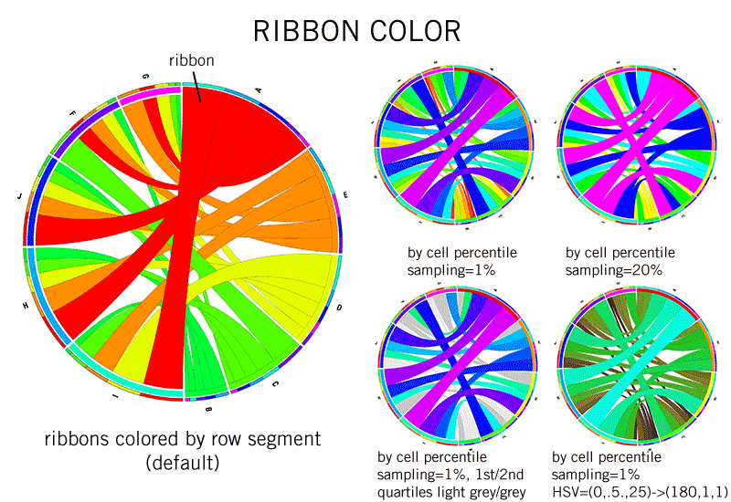

# GCModeller.Circos
Circos API for GCModeller



###### Development Requirements

1. sciBASIC# package

```bash
# nuget: https://www.nuget.org/packages/sciBASIC#
# github: https://github.com/xieguigang/sciBASIC#

PM> Install-Package sciBASIC -Pre
```
